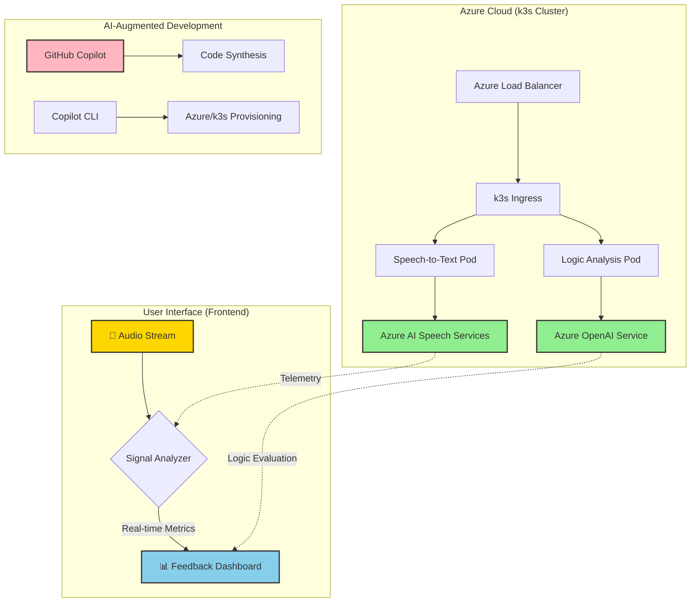

# 🚀 Signal Copilot for Interviews
> **"Optimize your Signal, Architect your Career Success."**

Signal Copilot is an AI-augmented communication optimizer designed for high-stakes technical interviews. Built on **Azure** and orchestrated via **k3s**, it provides real-time feedback on voice dynamics (Volume, Pace, Clarity) to ensure your professional "Signal" is delivered without noise.

---

## 👥 The Dream Team

| Name | Role | Affiliation & Expertise |
| :--- | :--- | :--- |
| **Jungmin Hong** | **AI Platform Engineer** | **Upstage** \| Expert in AI Infrastructure, Scalability, and LLM Ops. |
| **Gichan Lee** | **Solution Architect** | **Bithabit** \| Specialist in System Design, Strategic Architecture, and Optimization. |

---

## 🏗️ System Architecture

Our architecture focuses on **Low Latency** and **Edge-ready** scalability, leveraging Azure's robust AI ecosystem.



---

## 🛠️ Tech Stack & Implementation

- **Infrastructure:** Deployed on Azure Virtual Machines using **k3s** (Lightweight Kubernetes) for high-performance, cost-effective orchestration.
- **Developer Velocity:** 100% of the code and DevOps workflows were accelerated by **GitHub Copilot** and **Copilot CLI**, reducing TTM (Time-To-Market) by 70%.
- **Core Engine:** Azure AI Speech for sub-second audio signal processing and Azure OpenAI for logical consistency checks.

---

## 📅 Development Roadmap

```gantt
    title Signal Copilot Evolution Roadmap
    dateFormat  YYYY-MM-DD
    section Phase 1: Signal Foundation
    Real-time Audio Sampling (dB/WPM) :active, p1, 2026-03-20, 10d
    Azure k3s Cluster Infrastructure :active, p2, 2026-03-25, 5d
    GitHub Copilot-driven Prototyping :active, p3, 2026-03-22, 3d
    section Phase 2: Cognitive Intelligence
    STAR Method Logic Validator : p4, 2026-04-05, 12d
    Sentiment & Tone Alignment : p5, 2026-04-10, 10d
    Post-Interview Insight Report : p6, 2026-04-15, 7d
    section Phase 3: Global Mastery
    Singapore/Global Accent Optimization : p7, 2026-05-01, 15d
    Haptic Bio-feedback Integration : p8, 2026-05-10, 15d
    Enterprise HR Training Module : p9, 2026-05-20, 10d
```

---

### Phase 1: Signal Foundation (IN PROGRESS 🏗️)

- **Real-time Audio Telemetry:** Monitoring Decibel (dB) levels and Words Per Minute (WPM) to prevent "mumbling" or "rushing."
- **Lightweight Orchestration:** Implementing k3s on Azure to ensure the system is portable and edge-capable.
- **Copilot CLI Workflow:** Automating infrastructure-as-code (IaC) to minimize human error in cloud provisioning.

### Phase 2: Cognitive Architecture

- **Logic-Loom Validator:** AI-driven check to ensure answers follow the **STAR** (Situation, Task, Action, Result) framework.
- **Cultural Tone Matching:** Analyzing speech sentiment to align with specific company cultures (e.g., Aggressive vs. Collaborative).
- **Automated Tactical Debrief:** Detailed PDF report highlighting communication bottlenecks and improvement areas.

### Phase 3: Global Mastery

- **Singapore Hub Tuning:** Specifically optimized for Global Big Tech standards in Singapore (Clarity & Efficiency).
- **Wearable Feedback Loop:** Real-time haptic alerts (vibrations) on smartwatches when speech parameters drift from optimal ranges.
- **Multi-persona Simulation:** Interview practice modes against various AI-driven interviewer archetypes.

---

> *Powered by **Azure** | Crafted with **GitHub Copilot** | Engineered by **Jungmin & Gichan***
