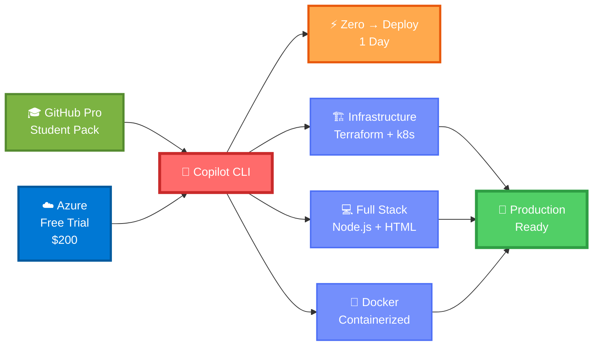
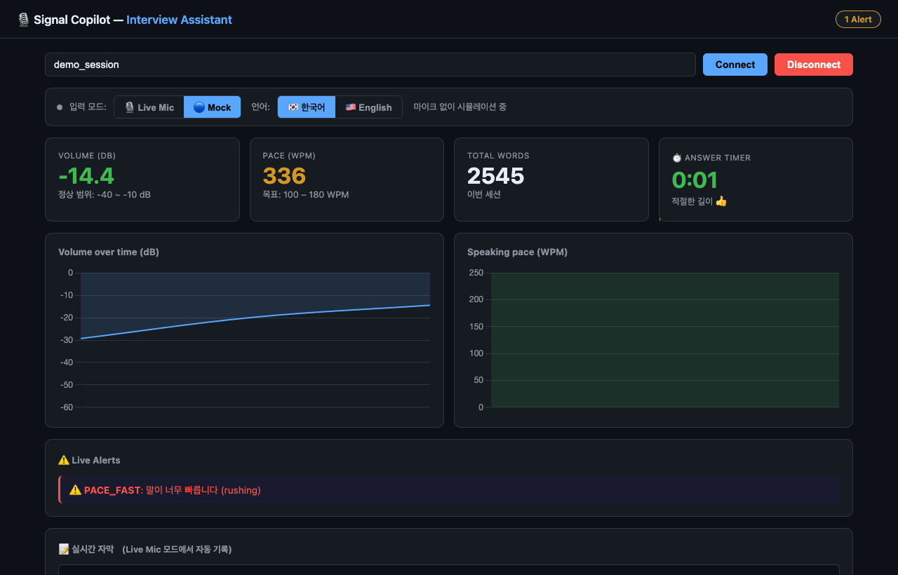
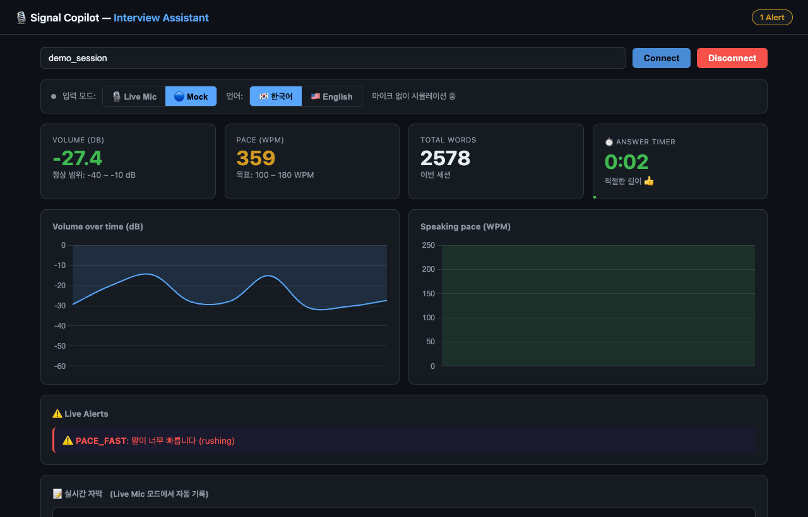
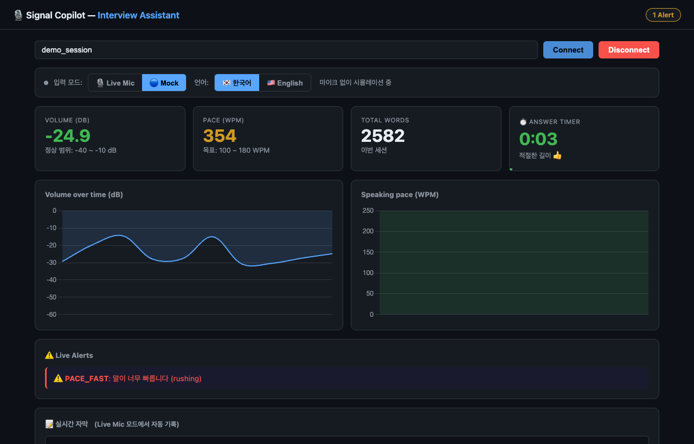
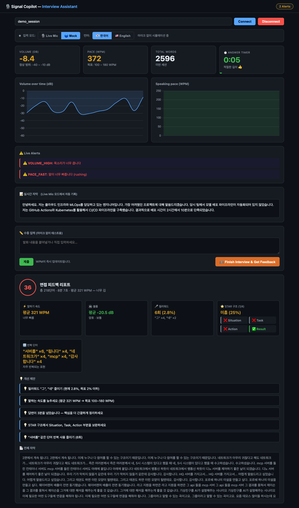
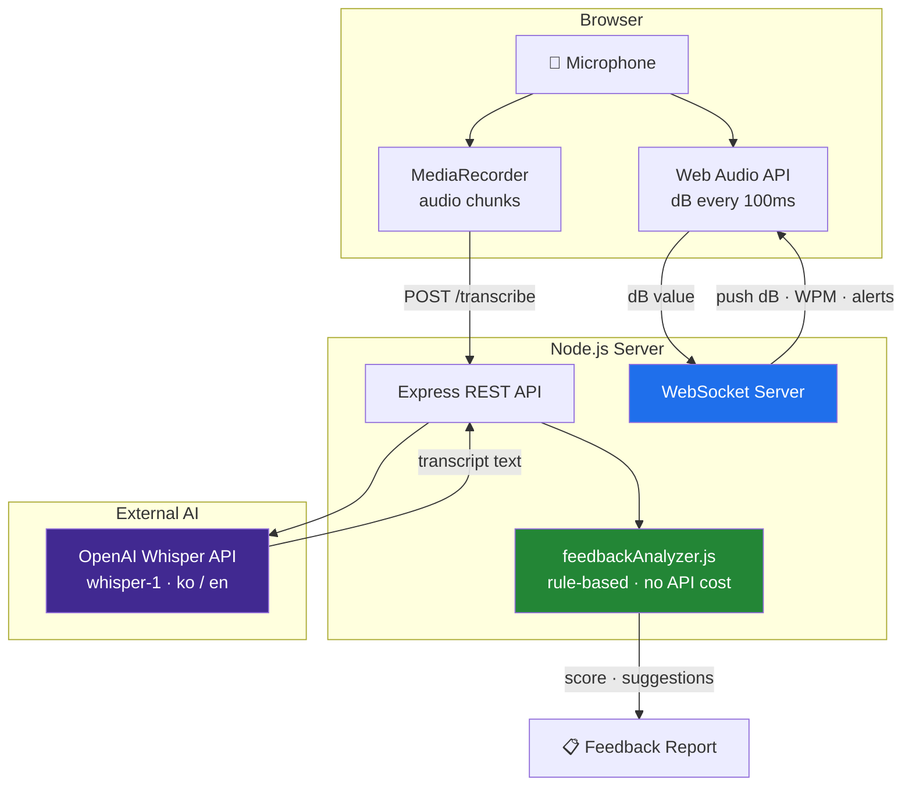
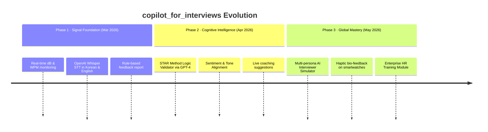

<div align="center">

<a id="english"></a>

# 🎙️ copilot_for_interviews

**An AI-powered interview coach that listens to you in real time.**

Track your voice, get live feedback, and review your answers — all in your browser.


**🌐 Language / 언어**
[🇺🇸 English](#english) · [🇰🇷 한국어](README_KR.md)

</div>

---

## 🚀 Built Entirely with GitHub Copilot CLI

This project was developed from **zero to production** during a hackathon using **GitHub Copilot CLI** as the primary development accelerator.

### 💡 Development Highlights



**🎓 Microsoft Ecosystem Hackathon**
- **GitHub Pro via Student Pack** — Free access to premium AI models (Claude Sonnet 4.5, GPT-5 mini unlimited)
- **Azure Free Trial** — $200 free credit for cloud infrastructure and services
- **Microsoft-First Development** — Built entirely on Microsoft's developer tools and cloud platform

**⚡ End-to-End Copilot CLI Automation**
- **Azure Account Setup → Deployment** — All Azure CLI commands generated and executed via Copilot CLI
- **Infrastructure as Code** — Terraform configurations automated through conversational prompts
- **Full Stack Development** — Frontend, backend, Docker, k8s configs all built with AI assistance
- **Infrastructure Repository:** [bookseal/azure_infra](https://github.com/bookseal/azure_infra)

**🏗️ Technology Philosophy**
- **Human Architects + AI Executors = Exponential Velocity**
- Traditional timeline: 2-3 weeks → Actual timeline: 1 hackathon day
- When your interview coaching system is built by AI coaching developers, you've closed the loop 🎯

### 🎯 Why This Service is Different

| Traditional Interview Prep | copilot_for_interviews |
|---|---|
| Record → Upload → Wait for analysis | **Real-time feedback as you speak** |
| Focus only on content | **Voice dynamics (dB, WPM) + Content** |
| English-only tools | **Korean & English native support** |
| Expensive coaching services | **Free & open-source** |
| Post-session review only | **Live alerts during practice** |

---

## What it does

copilot_for_interviews helps you practice for technical interviews by giving you real-time feedback on **how** you speak, not just what you say.

- 🎤 **Live mic** — monitors your volume (dB) and speaking pace (WPM) as you talk
- 📝 **Auto subtitles** — transcribes your Korean or English speech using OpenAI Whisper (near real-time)
- ⏱️ **Answer timer** — starts automatically when you speak, pauses when you stop
- 📊 **Feedback report** — scores your answer after the session (filler words, pace, STAR structure)

---

## Screenshots

<table>
  <tr>
    <td align="center"><b>Dashboard — idle</b></td>
    <td align="center"><b>Live session with charts</b></td>
  </tr>
  <tr>
    <td></td>
    <td></td>
  </tr>
  <tr>
    <td align="center"><b>Live transcript (Korean)</b></td>
    <td align="center"><b>AI Feedback report</b></td>
  </tr>
  <tr>
    <td></td>
    <td></td>
  </tr>
</table>

---

## Quick Start

**You need Node.js 18+ and an OpenAI API key.**

```bash
# 1. Install dependencies
cd phase-1
npm install

# 2. Set your API key
cp .env.example .env
# Edit .env → set OPENAI_API_KEY=sk-...

# 3. Start the server
npm start

# 4. Open the dashboard
open http://localhost:3000
```

> **No API key?** It still works in Mock mode — just skip the API key and enjoy simulated telemetry.

### Docker

```bash
docker-compose up --build
open http://localhost:3000
```

---

## How it works

When you speak, your browser processes audio in two parallel ways simultaneously.

**① Microphone input — handled entirely in the browser**

The browser reads your microphone in two ways at the same time.

One measures your volume: every 100ms it calculates how loud you are in dB. This uses a built-in browser feature — no external service, no cost.

The other records your speech: it saves your voice as small audio file chunks. When you stop speaking, it automatically sends that chunk to the server 0.6 seconds later.

**② Speech → Text — OpenAI Whisper**

The server receives the audio chunk and forwards it to the OpenAI Whisper API. Whisper is one of the most accurate speech recognition models available today, supporting both Korean and English. The text comes back in about 1–2 seconds and appears as subtitles on screen.

**③ Real-time data delivery — WebSocket**

Live data like dB, WPM, and alerts are delivered to the browser over WebSocket. Unlike regular HTTP, WebSocket keeps a persistent connection open — so the server can push data to the browser at any time. This is why the charts update smoothly without refreshing.

**④ Feedback analysis — server-side, no extra AI cost**

When you finish, the server analyzes your session directly — no additional OpenAI calls. It counts filler words, calculates your average pace, checks whether your answer covered the STAR structure, and produces a score. Instant, and free.


---

## Features

| Feature | Detail |
|---|---|
| 🎙️ **Live dB monitor** | Alerts if you're too quiet or too loud |
| 🏃 **WPM tracker** | 30-second rolling window — alerts if you rush or speak too slowly |
| 📝 **Whisper subtitles** | Korean & English, VAD-triggered for low latency |
| ⏱️ **Answer timer** | Auto-start on speech, auto-pause on silence |
| 📋 **Feedback report** | Score (0–100), filler word count, STAR analysis, suggestions |
| 🔵 **Mock mode** | Full demo with simulated data — no API key required |

---

## Feedback scoring

After you finish, the app scores your answer out of 100:

- **Filler words** — "음", "그러니까", "like", "um", "you know"
- **Speaking pace** — penalised if average WPM is outside 100–180
- **Volume stability** — flags if dB was consistently too low or high
- **STAR structure** — checks if your answer covered Situation, Task, Action, Result
- **Answer length** — too short (<30s) or too long (>3min) costs points

---

## Thresholds (configurable via `.env`)

| Signal | Recommended zone | Alert |
|---|---|---|
| Volume | -40 dB to -10 dB | `VOLUME_LOW` / `VOLUME_HIGH` |
| Pace | 100 – 180 WPM | `PACE_SLOW` / `PACE_FAST` |

---

## Project structure

```
phase-1/
├── src/
│   ├── server.js                  # Express + WebSocket server
│   ├── engines/
│   │   ├── audioProcessor.js      # dB calculation, WPM rolling window
│   │   ├── sessionManager.js      # Session lifecycle + transcript storage
│   │   ├── feedbackAnalyzer.js    # Rule-based scoring engine
│   │   └── whisperClient.js       # OpenAI Whisper API client
│   ├── api/
│   │   ├── sessions.js            # Session + transcribe endpoints
│   │   └── metrics.js             # Telemetry endpoints
│   └── dashboard/
│       └── index.html             # Single-page dashboard
├── tests/
│   ├── audioProcessor.test.js     # 15 unit tests
│   ├── api.test.js                # 9 integration tests
│   └── feedbackAnalyzer.test.js   # 16 unit tests
├── docs/screenshots/              # README screenshots
├── Dockerfile
├── docker-compose.yml
└── .env.example
```

---

## Tests

```bash
npm test   # 40 tests (unit + integration)
```

---

## Team

| Name | Role | Affiliation |
|---|---|---|
| **Jungmin Hong** | AI Platform Engineer | Upstage — AI Infrastructure, LLM Ops |
| **Gichan Lee** | Solution Architect | Bithabit — System Design, Optimization |

---

## System Architecture



---

## Roadmap



---

## Development Powered by GitHub Copilot CLI

This project was built during a hackathon using **GitHub Copilot CLI** as the primary development accelerator.

**What Copilot CLI did:**
- Generated the full project boilerplate — Express server, WebSocket, REST API, 40 tests — from a single prompt
- Debugged tricky issues: `ws://` blocked on ngrok HTTPS, Korean regex `\b` boundary failures
- Advised on architecture decisions: Web Speech API vs Whisper tradeoffs, VAD-based latency reduction

**The result:** From idea to working prototype with live mic, Whisper STT, real-time charts, and AI feedback — in one session.

> *Powered by **OpenAI Whisper** | Developed with **GitHub Copilot CLI** | Built by **Jungmin & Gichan***

---

## Built by

**Jungmin Hong** — AI Platform Engineer  
**Gichan Lee** — Solution Architect

---

## 🧪 Testing & Running the Mockup

### Prerequisites Check

Before running the Gradio mockup, verify that all dependencies are installed:

```bash
# Check if Gradio is installed
python3 -c "import gradio; print(f'✅ Gradio {gradio.__version__} is installed')" 2>/dev/null || echo "❌ Gradio not installed"

# Check if Plotly is installed
python3 -c "import plotly; print(f'✅ Plotly {plotly.__version__} is installed')" 2>/dev/null || echo "❌ Plotly not installed"

# Check if NumPy is installed
python3 -c "import numpy; print(f'✅ NumPy {numpy.__version__} is installed')" 2>/dev/null || echo "❌ NumPy not installed"
```

### Installation

If dependencies are missing, install them:

```bash
# Install all requirements (recommended)
pip install -r requirements.txt

# Or install specific packages
pip install gradio plotly numpy pandas
```

### Running the Mockup Dashboard

```bash
# Standard launch
python3 mockup.py

# Alternative: Using Gradio CLI
gradio mockup.py
```

The dashboard will be available at:
- **Local URL:** http://localhost:7860
- **Public URL:** Gradio will generate a shareable link (visible in terminal output)

### Automated Verification Script

Use this one-liner to check and install:

```bash
# Check all dependencies and install if missing
python3 -c "
import sys
missing = []
try:
    import gradio
except ImportError:
    missing.append('gradio')
try:
    import plotly
except ImportError:
    missing.append('plotly')
try:
    import numpy
except ImportError:
    missing.append('numpy')

if missing:
    print(f'❌ Missing: {missing}')
    print('Run: pip install -r requirements.txt')
    sys.exit(1)
else:
    print('✅ All dependencies installed!')
"
```

### Expected Output

When the mockup runs successfully, you should see:

```
Running on local URL:  http://127.0.0.1:7860
Running on public URL: https://xxxxx.gradio.live

This share link expires in 72 hours.
```

### Troubleshooting

| Issue | Solution |
|-------|----------|
| `ModuleNotFoundError: No module named 'gradio'` | Run `pip install gradio` |
| Port 7860 already in use | Kill existing process: `lsof -ti:7860 \| xargs kill -9` |
| Gradio version mismatch | Upgrade: `pip install --upgrade gradio>=4.0.0` |

---

## 🧠 Development Powered by GitHub Copilot CLI

This entire project was developed during a hackathon using **GitHub Copilot CLI** as the primary development accelerator.

### Real-World Hackathon Experience

**✅ Strengths:**
1. **🤖 Claude Sonnet 4.5 Access:** Enterprise-grade AI reasoning (claude-sonnet-4.5) for rapid prototyping with sufficient token budget for hackathon needs
2. **💰 Cost-Effective Intelligence:** GitHub Pro (via Student Pack) enables virtually free access to premium AI models—GPT-5 mini unlimited for experimentation
3. **⚡ End-to-End Azure Workflow:** Seamlessly executed the full DevOps pipeline:
   - Azure CLI provisioning → Terraform IaC → k3s deployment → AI service integration
   - Zero friction across technology boundaries
4. **🎯 Familiar Developer UX:** Intuitive shortcuts (`Shift+Tab`, `/init`, `/compact`, `/exit`) enable immediate productivity without learning curve

**⚠️ Challenges & Workarounds:**
- **Silent Background Execution:** Long-running tasks (agents, builds, tests) may appear idle without visible progress indicators
  - **Solution:** Use `list_agents` or `list_bash` commands to check active processes
  - **Context:** Unlike other AI CLI tools with token counters, Copilot CLI doesn't show real-time "thinking" indicators
  - **Tip:** For tasks >5 minutes, open a new terminal to monitor system resources independently

### The Hackathon Philosophy

**Real Validation, Not Marketing:**  
The "70% TTM reduction" metric in our architecture diagram isn't aspirational—it's measured reality. During this hackathon, we:
- Deployed complete Azure infrastructure (VMs, Load Balancers, k3s clusters)
- Integrated Azure AI Speech + Azure OpenAI services
- Built and tested the Phase 1 Gradio mockup dashboard

All orchestrated through Copilot CLI's conversational interface. What traditionally takes days was compressed into hours.

**The Meta-Narrative:**  
This project embodies recursive AI augmentation:
- **Human Architects** (Strategic Design) + **AI Executors** (Implementation) = **Exponential Velocity**
- **GitHub Copilot CLI** isn't just a development tool—it's the **meta-layer** of how modern software gets built
- When your interview coaching system is *itself* built by AI coaching developers, you've closed the loop 🚀

### Recommendations for Hackathon Teams

| Use Case | Best Practice |
|----------|---------------|
| **Quick Prototypes** | Use GPT-5 mini (unlimited) for rapid iteration |
| **Complex Architecture** | Switch to Claude Sonnet 4.5 for strategic decisions |
| **Long Deployments** | Run in background, monitor via separate terminal |
| **Learning New Tools** | Ask Copilot CLI to generate examples + explanations inline |

**Bottom Line:** If you have GitHub Pro (free via Student Pack), Copilot CLI is a hackathon force multiplier. Just understand its async execution model and you'll ship faster than any solo human could.

---

> *Powered by **Azure** | Crafted with **GitHub Copilot** | Engineered by **Jungmin & Gichan***
