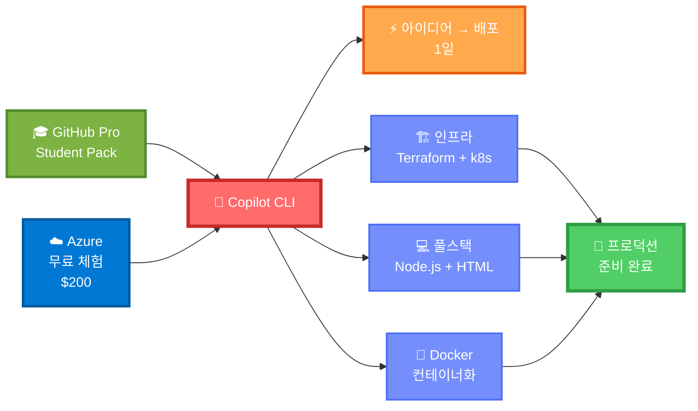
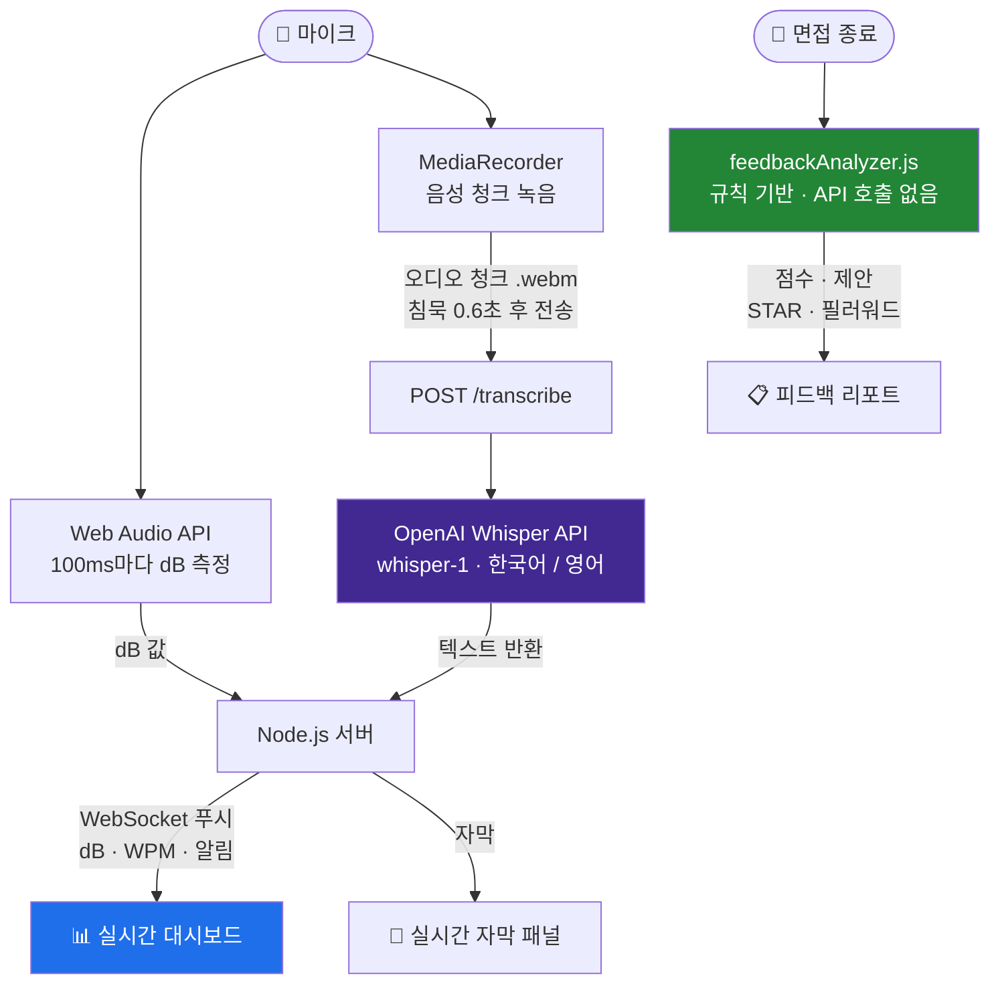
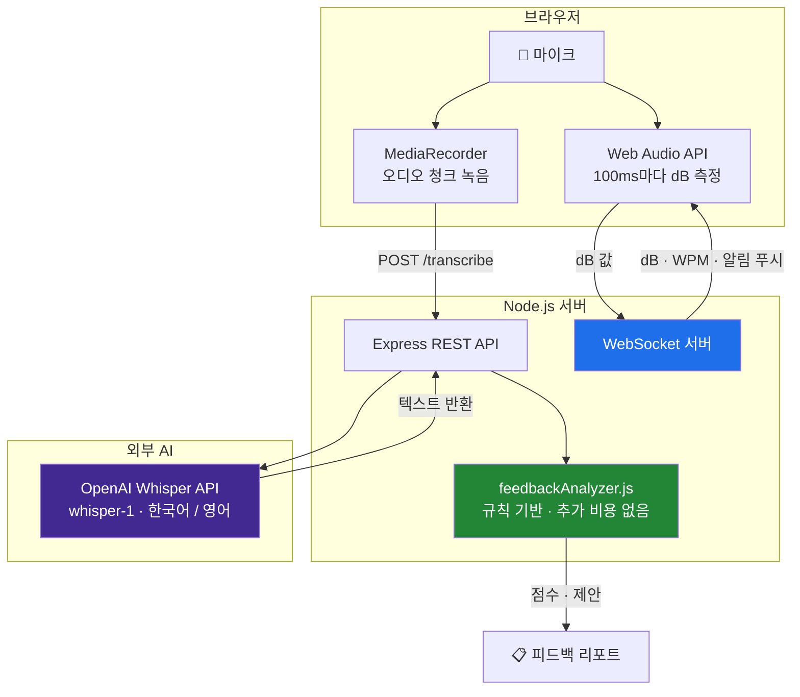
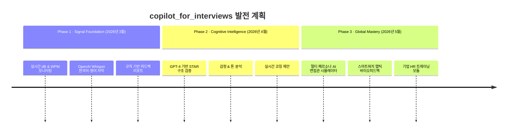

<div align="center">

<a id="korean"></a>

# 🎙️ copilot_for_interviews

**실시간으로 당신의 목소리를 듣고 피드백을 주는 AI 면접 코치.**

브라우저에서 바로 실행 — 목소리를 모니터링하고, 실시간 자막을 보고, 면접 후 분석 리포트를 확인하세요.


**🌐 Language / 언어**
[🇺🇸 English](README.md) · [🇰🇷 한국어](#korean)

</div>

---

## 🚀 GitHub Copilot CLI로 처음부터 끝까지 개발

이 프로젝트는 해커톤에서 **GitHub Copilot CLI**를 주요 개발 가속 도구로 활용해 **아이디어에서 프로덕션까지** 완성했습니다.

### 💡 개발 하이라이트



**🎓 Microsoft 에코시스템 해커톤**
- **GitHub Pro (Student Pack)** — 프리미엄 AI 모델 무료 접근 (Claude Sonnet 4.5, GPT-5 mini 무제한)
- **Azure 무료 체험** — 클라우드 인프라 및 서비스용 $200 무료 크레딧
- **Microsoft 우선 개발** — Microsoft 개발자 도구와 클라우드 플랫폼으로 전체 개발

**⚡ Copilot CLI 엔드투엔드 자동화**
- **Azure 계정 설정 → 배포** — 모든 Azure CLI 명령을 Copilot CLI로 생성 및 실행
- **Infrastructure as Code** — 대화형 프롬프트를 통한 Terraform 구성 자동화
- **풀스택 개발** — 프론트엔드, 백엔드, Docker, k8s 설정 모두 AI 지원으로 구축
- **인프라 저장소:** [bookseal/azure_infra](https://github.com/bookseal/azure_infra)

**🏗️ 기술 철학**
- **인간 아키텍트 + AI 실행자 = 기하급수적 속도**
- 기존 일정: 2-3주 → 실제 일정: 해커톤 1일
- 면접 코칭 시스템이 AI가 코칭하는 개발자에 의해 만들어졌을 때, 순환이 완성됩니다 🎯

### 🎯 이 서비스가 다른 이유

| 기존 면접 준비 | copilot_for_interviews |
|---|---|
| 녹음 → 업로드 → 분석 대기 | **말하는 동시에 실시간 피드백** |
| 내용에만 집중 | **음성 역학 (dB, WPM) + 내용** |
| 영어 전용 도구 | **한국어 & 영어 네이티브 지원** |
| 비싼 코칭 서비스 | **무료 & 오픈소스** |
| 세션 후 리뷰만 가능 | **연습 중 실시간 알림** |

---

## 무엇을 하나요?

copilot_for_interviews는 기술 면접 연습을 도와주는 도구입니다. **무슨 말을 하는지**가 아니라 **어떻게 말하는지**에 집중합니다.

- 🎤 **라이브 마이크** — 말하는 동안 실시간으로 음량(dB)과 말 속도(WPM)를 측정
- 📝 **자동 자막** — OpenAI Whisper로 한국어/영어 음성을 실시간 텍스트로 변환
- ⏱️ **답변 타이머** — 말하면 자동 시작, 멈추면 자동 일시정지
- 📊 **피드백 리포트** — 세션이 끝나면 점수와 개선 제안 제공 (필러워드, 속도, STAR 구조 분석)

---

## 스크린샷

<table>
  <tr>
    <td align="center"><b>대시보드 — 시작 전</b></td>
    <td align="center"><b>라이브 세션 (차트 실시간 업데이트)</b></td>
  </tr>
  <tr>
    <td></td>
    <td></td>
  </tr>
  <tr>
    <td align="center"><b>실시간 자막 (한국어)</b></td>
    <td align="center"><b>AI 피드백 리포트</b></td>
  </tr>
  <tr>
    <td></td>
    <td></td>
  </tr>
</table>

---

## 빠른 시작

**Node.js 18 이상과 OpenAI API 키가 필요합니다.**

```bash
# 1. 의존성 설치
cd phase-1
npm install

# 2. API 키 설정
cp .env.example .env
# .env 파일을 열어서 OPENAI_API_KEY=sk-... 입력

# 3. 서버 시작
npm start

# 4. 브라우저에서 열기
open http://localhost:3000
```

> **API 키 없어도 됩니다.** Mock 모드로 실행하면 시뮬레이션 데이터로 모든 기능을 체험할 수 있습니다.

### Docker로 실행

```bash
docker-compose up --build
open http://localhost:3000
```

---

## 작동 원리

말을 하면 브라우저가 오디오를 두 가지 방식으로 동시에 처리합니다.

**① 마이크 입력 — 브라우저가 직접 처리**

브라우저가 마이크를 두 가지 방식으로 동시에 읽습니다.

하나는 음량 측정입니다. 100ms마다 지금 얼마나 크게 말하는지를 dB 숫자로 계산합니다. 브라우저 내장 기능이라 별도 비용이 없습니다.

다른 하나는 녹음입니다. 말하는 동안 음성을 파일 조각으로 저장합니다. 말이 멈추면 0.6초 후에 자동으로 그 조각을 서버로 보냅니다.

**② 음성 → 텍스트 변환 — OpenAI Whisper**

서버가 오디오 조각을 받으면 OpenAI Whisper API로 전달합니다. Whisper는 현재 가장 정확한 음성인식 모델 중 하나로, 한국어와 영어를 모두 지원합니다. 약 1~2초 후에 텍스트가 돌아오고, 화면의 자막으로 표시됩니다.

**③ 실시간 데이터 전달 — WebSocket**

dB, WPM, 알림 같은 실시간 데이터는 WebSocket으로 브라우저에 전달됩니다. HTTP와 달리 연결을 계속 유지하기 때문에 서버가 언제든지 브라우저로 데이터를 밀어넣을 수 있습니다. 차트가 끊기지 않고 실시간으로 움직이는 이유입니다.

**④ 피드백 분석 — 서버 자체 계산, 추가 AI 비용 없음**

면접이 끝나면 서버가 직접 분석합니다. OpenAI를 추가로 호출하지 않습니다. 쌓인 자막에서 필러워드를 세고, 평균 속도를 계산하고, STAR 구조 키워드가 있었는지 확인해서 점수를 냅니다. 즉각적이고 추가 비용이 없습니다.



---

## 주요 기능

| 기능 | 설명 |
|---|---|
| 🎙️ **라이브 음량 모니터** | 너무 작거나 크면 경고 |
| 🏃 **말 속도 측정** | 30초 롤링 윈도우 — 너무 빠르거나 느리면 경고 |
| 📝 **Whisper 자막** | 한국어·영어 지원, VAD 기반 저지연 자막 |
| ⏱️ **답변 타이머** | 말하면 자동 시작, 침묵하면 자동 일시정지 |
| 📋 **피드백 리포트** | 100점 기준 점수, 필러워드 횟수, STAR 분석, 개선 제안 |
| 🔵 **Mock 모드** | API 키 없이도 시뮬레이션 데이터로 전체 기능 체험 |

---

## 피드백 채점 기준

면접이 끝나면 100점 기준으로 채점합니다:

- **필러워드** — "음", "그러니까", "like", "um", "you know" 등
- **말 속도** — 평균 WPM이 100~180 범위를 벗어나면 감점
- **음량 안정성** — dB가 지속적으로 너무 낮거나 높으면 감점
- **STAR 구조** — 상황(Situation), 과제(Task), 행동(Action), 결과(Result) 포함 여부
- **답변 길이** — 30초 미만이거나 3분 초과 시 감점

---

## 임계값 설정 (`.env`에서 변경 가능)

| 신호 | 권장 범위 | 경고 종류 |
|---|---|---|
| 음량 | -40 dB ~ -10 dB | `VOLUME_LOW` / `VOLUME_HIGH` |
| 속도 | 100 ~ 180 WPM | `PACE_SLOW` / `PACE_FAST` |

---

## 프로젝트 구조

```
phase-1/
├── src/
│   ├── server.js                  # Express + WebSocket 서버
│   ├── engines/
│   │   ├── audioProcessor.js      # dB 계산, WPM 롤링 윈도우
│   │   ├── sessionManager.js      # 세션 관리 + 자막 저장
│   │   ├── feedbackAnalyzer.js    # 규칙 기반 채점 엔진
│   │   └── whisperClient.js       # OpenAI Whisper API 클라이언트
│   ├── api/
│   │   ├── sessions.js            # 세션 + 자막 변환 엔드포인트
│   │   └── metrics.js             # 텔레메트리 엔드포인트
│   └── dashboard/
│       └── index.html             # 단일 페이지 대시보드
├── tests/
│   ├── audioProcessor.test.js     # 15개 유닛 테스트
│   ├── api.test.js                # 9개 통합 테스트
│   └── feedbackAnalyzer.test.js   # 16개 유닛 테스트
├── docs/screenshots/              # README 스크린샷
├── Dockerfile
├── docker-compose.yml
└── .env.example
```

---

## 테스트

```bash
npm test   # 40개 테스트 실행 (유닛 + 통합)
```

---

## 팀

| 이름 | 역할 | 소속 |
|---|---|---|
| **홍정민 (Jungmin Hong)** | AI Platform Engineer | Upstage — AI 인프라, LLM Ops |
| **이기찬 (Gichan Lee)** | Solution Architect | Bithabit — 시스템 설계, 최적화 |

---

## 시스템 아키텍처



---

## 로드맵



---

## GitHub Copilot CLI로 개발

이 프로젝트는 해커톤에서 **GitHub Copilot CLI**를 주요 개발 가속 도구로 활용해 만들었습니다.

**Copilot CLI가 한 일:**
- 프롬프트 하나로 전체 보일러플레이트 생성 — Express 서버, WebSocket, REST API, 테스트 40개
- 까다로운 버그 즉시 해결: ngrok HTTPS에서 `ws://` 차단 문제, 한국어 정규식 `\b` 경계 오류
- 아키텍처 결정 조언: Web Speech API vs Whisper 트레이드오프, VAD 기반 지연 감소

**결과:** 아이디어에서 라이브 마이크 + Whisper 자막 + 실시간 차트 + AI 피드백까지 — 한 세션 만에 완성.

> *OpenAI Whisper 기반 | **GitHub Copilot CLI**로 개발 | **Jungmin & Gichan** 제작*

---

## 만든 사람

**홍정민 (Jungmin Hong)** — AI Platform Engineer
**이기찬 (Gichan Lee)** — Solution Architect

---

## 🧪 테스트 & 목업 실행

### 사전 요구사항 확인

Gradio 목업을 실행하기 전에 모든 의존성이 설치되어 있는지 확인하세요:

```bash
# Gradio 설치 확인
python3 -c "import gradio; print(f'✅ Gradio {gradio.__version__} 설치됨')" 2>/dev/null || echo "❌ Gradio 미설치"

# Plotly 설치 확인
python3 -c "import plotly; print(f'✅ Plotly {plotly.__version__} 설치됨')" 2>/dev/null || echo "❌ Plotly 미설치"

# NumPy 설치 확인
python3 -c "import numpy; print(f'✅ NumPy {numpy.__version__} 설치됨')" 2>/dev/null || echo "❌ NumPy 미설치"
```

### 설치

의존성이 없는 경우 설치하세요:

```bash
# 전체 요구사항 설치 (권장)
pip install -r requirements.txt

# 또는 개별 패키지 설치
pip install gradio plotly numpy pandas
```

### 목업 대시보드 실행

```bash
# 기본 실행
python3 mockup.py

# 대안: Gradio CLI 사용
gradio mockup.py
```

대시보드 접속 주소:
- **로컬 URL:** http://localhost:7860
- **공개 URL:** Gradio가 공유 가능한 링크를 생성합니다 (터미널 출력에서 확인)

### 자동 검증 스크립트

의존성 확인 및 설치를 위한 원라이너:

```bash
# 모든 의존성 확인 및 미설치 시 안내
python3 -c "
import sys
missing = []
try:
    import gradio
except ImportError:
    missing.append('gradio')
try:
    import plotly
except ImportError:
    missing.append('plotly')
try:
    import numpy
except ImportError:
    missing.append('numpy')

if missing:
    print(f'❌ 미설치: {missing}')
    print('실행: pip install -r requirements.txt')
    sys.exit(1)
else:
    print('✅ 모든 의존성 설치 완료!')
"
```

### 예상 출력

목업이 정상적으로 실행되면 다음과 같이 표시됩니다:

```
Running on local URL:  http://127.0.0.1:7860
Running on public URL: https://xxxxx.gradio.live

This share link expires in 72 hours.
```

### 문제 해결

| 문제 | 해결 방법 |
|-------|----------|
| `ModuleNotFoundError: No module named 'gradio'` | `pip install gradio` 실행 |
| 포트 7860이 이미 사용 중 | 기존 프로세스 종료: `lsof -ti:7860 \| xargs kill -9` |
| Gradio 버전 불일치 | 업그레이드: `pip install --upgrade gradio>=4.0.0` |

---

## 🧠 GitHub Copilot CLI 기반 개발

이 프로젝트 전체는 해커톤에서 **GitHub Copilot CLI**를 주요 개발 가속 도구로 활용해 개발되었습니다.

### 실제 해커톤 경험

**✅ 강점:**
1. **🤖 Claude Sonnet 4.5 접근:** 엔터프라이즈급 AI 추론(claude-sonnet-4.5)으로 빠른 프로토타이핑, 해커톤에 충분한 토큰 예산
2. **💰 비용 효율적 인텔리전스:** GitHub Pro(Student Pack)를 통해 프리미엄 AI 모델에 사실상 무료 접근 — GPT-5 mini 무제한 실험
3. **⚡ 엔드투엔드 Azure 워크플로:** 전체 DevOps 파이프라인을 원활하게 실행:
   - Azure CLI 프로비저닝 → Terraform IaC → k3s 배포 → AI 서비스 통합
   - 기술 경계 간 마찰 제로
4. **🎯 친숙한 개발자 UX:** 직관적인 단축키(`Shift+Tab`, `/init`, `/compact`, `/exit`)로 학습 곡선 없이 즉시 생산성 발휘

**⚠️ 도전과 해결:**
- **조용한 백그라운드 실행:** 장시간 작업(에이전트, 빌드, 테스트)이 진행 상태 표시 없이 유휴 상태로 보일 수 있음
  - **해결:** `list_agents` 또는 `list_bash` 명령으로 활성 프로세스 확인
  - **맥락:** 토큰 카운터가 있는 다른 AI CLI 도구와 달리 Copilot CLI는 실시간 "사고 중" 표시가 없음
  - **팁:** 5분 이상 걸리는 작업은 새 터미널을 열어 시스템 리소스를 독립적으로 모니터링

### 해커톤 철학

**마케팅이 아닌 실제 검증:**
아키텍처 다이어그램의 "70% TTM 단축" 지표는 희망 사항이 아닌 측정된 현실입니다. 이번 해커톤에서 우리는:
- 완전한 Azure 인프라 배포 (VM, 로드 밸런서, k3s 클러스터)
- Azure AI Speech + Azure OpenAI 서비스 통합
- Phase 1 Gradio 목업 대시보드 구축 및 테스트

모두 Copilot CLI의 대화형 인터페이스를 통해 오케스트레이션했습니다. 보통 며칠 걸리는 작업이 몇 시간으로 압축되었습니다.

**메타 내러티브:**
이 프로젝트는 재귀적 AI 증강을 구현합니다:
- **인간 아키텍트** (전략적 설계) + **AI 실행자** (구현) = **기하급수적 속도**
- **GitHub Copilot CLI**는 단순한 개발 도구가 아니라 현대 소프트웨어가 구축되는 **메타 레이어**입니다
- 면접 코칭 시스템이 *AI가 코칭하는 개발자에 의해* 만들어졌을 때, 순환이 완성됩니다 🚀

### 해커톤 팀을 위한 추천

| 사용 사례 | 모범 사례 |
|----------|----------|
| **빠른 프로토타입** | 빠른 반복을 위해 GPT-5 mini (무제한) 사용 |
| **복잡한 아키텍처** | 전략적 결정을 위해 Claude Sonnet 4.5로 전환 |
| **장시간 배포** | 백그라운드 실행, 별도 터미널로 모니터링 |
| **새 도구 학습** | Copilot CLI에 예시 + 설명 인라인 생성 요청 |

**결론:** GitHub Pro(Student Pack 무료)가 있다면 Copilot CLI는 해커톤 역량 증폭기입니다. 비동기 실행 모델만 이해하면 어떤 개인 개발자보다 빠르게 배포할 수 있습니다.

---

> *Powered by **Azure** | **GitHub Copilot**으로 제작 | **Jungmin & Gichan** 설계*
