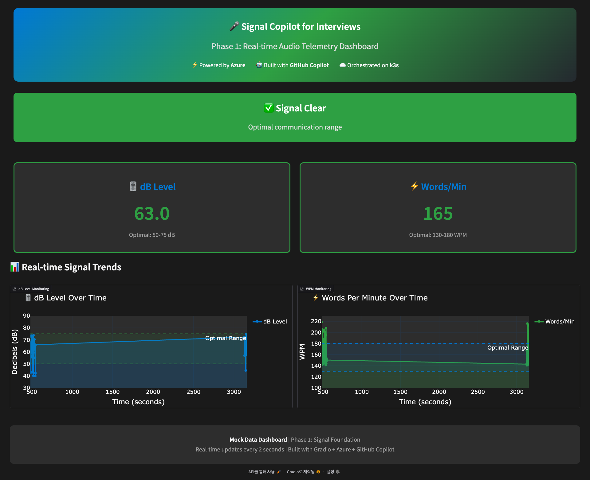

# Signal Copilot - Phase 1 Mockup

## Overview

This is an interactive mockup dashboard for **Phase 1: Signal Foundation** of the Signal Copilot for Interviews project. It demonstrates real-time audio telemetry monitoring with mock data.

## 📸 Screenshot



*Real-time audio telemetry dashboard with 1-column layout, persistent alerts, and high-contrast dark mode.*

## Features

### ✅ Implemented in This Mockup

- **Real-time dB Level Monitoring** (40-80 dB range)
- **Real-time WPM (Words Per Minute) Tracking** (120-180 WPM range)
- **5-Second Persistent Alerts** - Warnings persist for 5 seconds even after values normalize
- **1-Column Vertical Layout** - Optimized for better visibility and focus
- **Interactive Time-Series Charts** - Plotly-powered visualizations
- **High-Contrast Dark Mode UI** - Improved text visibility with bright accent colors
- **MS/GitHub/Azure Branding** - Branded header showcasing technology stack

### 🎨 UI/UX Highlights

- **Large Text:** 18px+ body text, 32px+ headings, 64px metrics display
- **High-Contrast Dark Theme:** #1a1a1a background with #ffffff text
- **Bright Accent Colors:** #3399ff (Azure blue), #3fca5f (GitHub green) for better visibility
- **Real-time Updates:** Dashboard refreshes every 2 seconds
- **Persistent Smart Alerts:** 
  - 🔇 **Too Quiet** (<50 dB) - persists for 5 seconds
  - 📢 **Too Loud** (>75 dB) - persists for 5 seconds
  - ⚡ **Too Fast** (>180 WPM) - persists for 5 seconds
  - 🐌 **Too Slow** (<130 WPM) - persists for 5 seconds
- **Single Column Layout:** All metrics and charts stacked vertically for clear viewing

## Requirements

- Python 3.8+
- Dependencies listed in `requirements.txt`

## Installation

1. **Create virtual environment:**
   ```bash
   python3 -m venv venv
   source venv/bin/activate  # On Windows: venv\Scripts\activate
   ```

2. **Install dependencies:**
   ```bash
   pip install -r requirements.txt
   ```

## Running the Mockup

```bash
python mockup.py
```

The dashboard will launch at `http://localhost:7860`

## How It Works

### Mock Data Generation

The mockup uses the `MockDataState` class to generate realistic simulated data:

- **dB Levels:** Random values between 55-75 dB (optimal range), with occasional dips to 35-45 dB to trigger "too quiet" alerts
- **WPM:** Random values between 140-170 WPM (optimal range), with occasional spikes to 185-220 WPM to trigger "too fast" alerts
- **History:** Maintains last 50 data points for trend visualization

### Alert System

The dashboard automatically detects and alerts when:
- **dB < 50:** "🔇 Speaking too quietly"
- **dB > 75:** "📢 Speaking too loudly"
- **WPM > 180:** "⚡ Speaking too fast"
- **WPM < 130:** "🐌 Speaking too slowly"

### Visualization

Two Plotly charts show:
1. **dB Level Over Time** - With optimal range shading (50-75 dB)
2. **WPM Over Time** - With optimal range shading (130-180 WPM)

Charts update every 2 seconds with new mock data.

## Phase 1 vs Future Phases

### Current Phase (Phase 1 - Mockup)
✅ UI/UX demonstration  
✅ Mock data simulation  
✅ Dashboard layout  
✅ Alert visualization  

### Future Development

**Phase 1 (Production):**
- Real audio input from microphone
- Actual dB level detection
- Real-time speech-to-text for WPM calculation
- Azure AI Speech integration

**Phase 2 (Cognitive Architecture):**
- STAR method validation
- Sentiment analysis
- Tone matching (Aggressive/Collaborative/Neutral)
- Post-interview debrief PDF

**Phase 3 (Global Mastery):**
- Accent optimization for Singapore/Global markets
- Haptic feedback on smartwatches
- Multi-persona interview simulator

## Technology Stack

- **Frontend Framework:** Gradio 4.0+
- **Visualization:** Plotly 5.0+
- **Data Processing:** Pandas, NumPy
- **Theme:** Custom CSS with dark mode
- **Deployment Target:** Azure k3s cluster (future)

## Customization

### Adjusting Alert Thresholds

Edit `update_dashboard()` function:
```python
db_ok = 50 <= current_db <= 75    # Change these values
wpm_ok = 130 <= current_wpm <= 180  # Change these values
```

### Changing Update Frequency

Modify the `every` parameter in `demo.load()`:
```python
demo.load(..., every=2)  # Change from 2 seconds
```

### Modifying Colors

Update CUSTOM_CSS or chart colors in `create_db_chart()` and `create_wpm_chart()`:
```python
line=dict(color='#0078D4', width=3)  # Azure blue
```

## Project Structure

```
phase1_mockup/
├── mockup.py                 # Main Gradio application
├── MOCKUP_README.md         # This documentation
├── mockup-screenshot.png    # Dashboard preview
└── requirements.txt         # Python dependencies (in root)
```

## Technology Stack

- **UI Framework:** Gradio 4.0+ with custom dark theme
- **Visualization:** Plotly 5.0+ for interactive charts
- **Data Processing:** NumPy for mock data generation
- **Deployment:** Local development server (port 7860)

---

**Note:** This is a UI mockup with simulated data. No actual audio processing is performed. Real audio integration will be implemented in the production version of Phase 1.
